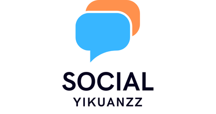

# Yikuanzz-Social 社交系统

  

## 项目需求分析

### 1.用户注册与登录系统

- 注册：用户可以通过邮箱、手机号或社交媒体账号进行注册。
- 登录：提供密码登录、手机验证码登录、社交媒体账号直接登录等多种方式。

### 2.用户界面设计

- 首页：展示最新动态、热门话题、推荐用户等。
- 个人主页：用户可以查看自己的发布内容、关注的人、粉丝等信息。
- 发布内容：允许用户发布文本、图片、视频、链接等多媒体内容。
- 搜索功能：提供关键词搜索、话题搜索、用户搜索等功能，方便用户找到所需信息。

### 3. 功能模块

- 动态发布：用户可以实时更新状态、分享想法、发布图片和视频。
- 话题功能：支持创建、参与话题讨论，话题可以关联到特定的事件或主题。
- 私信与消息通知：实现用户间的私信交流，以及对新关注、评论、点赞等的通知。
- 关注与粉丝管理：用户可以关注其他用户，查看其动态，管理自己的粉丝列表。
- 点赞与评论：用户可以对内容进行点赞、评论，增加互动性。
- 数据分析与报告：为用户提供分析自己和关注者行为的数据报告，如阅读量、互动率等。

### 4.社区管理与安全

- 举报与投诉：设置举报系统，用户可以举报不当内容。
- 社区准则：明确平台的使用规则和禁止内容，维护良好的社区环境。
- 隐私保护：确保用户的个人信息安全，提供隐私设置选项。

### 5.后台管理

- 内容审核：建立内容审核机制，防止不良信息传播。
- 数据分析：收集用户行为数据，用于优化产品和服务。
- 用户管理：管理员可以管理用户账户，处理违规行为。

## 项目技术栈

### 前端技术栈

- Next.js：用于构建网站前端，支持服务端渲染和静态站点生成。
- React：用于构建用户界面，支持组件化开发。
- TypeScript：用于类型 Script，提高代码质量。
- Tailwind CSS：用于快速构建响应式网站，减少开发时间。
- Ant-Design：用于快速构建交互组件，减少开发时间。
- Axios：用于发送 HTTP 请求，简化网络请求。

### 后端技术栈

- Golang：用于构建服务器端，支持快速开发。
- Gin：用于快速构建 Web 服务器，支持路由、中间件等。
- Gorm: 用于 ORM，简化数据库操作。
- MySQL：用于存储用户数据、动态数据等。
- Redis：用于缓存数据，提高访问速度。
